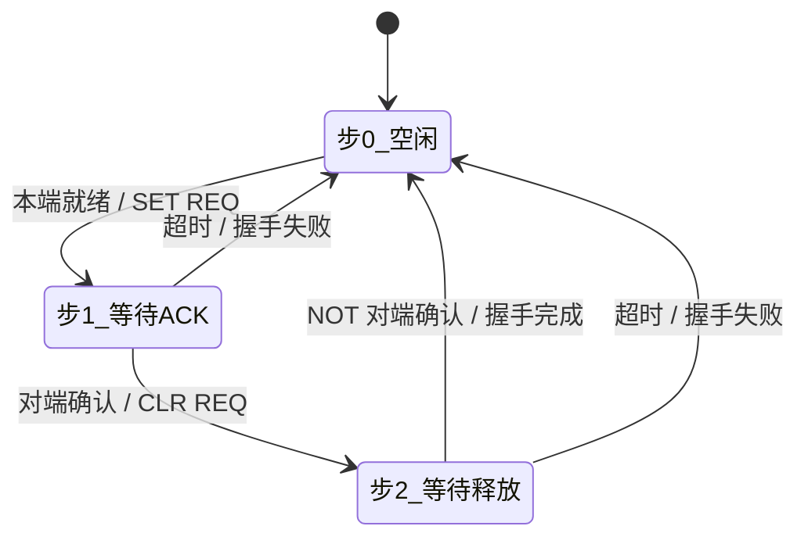
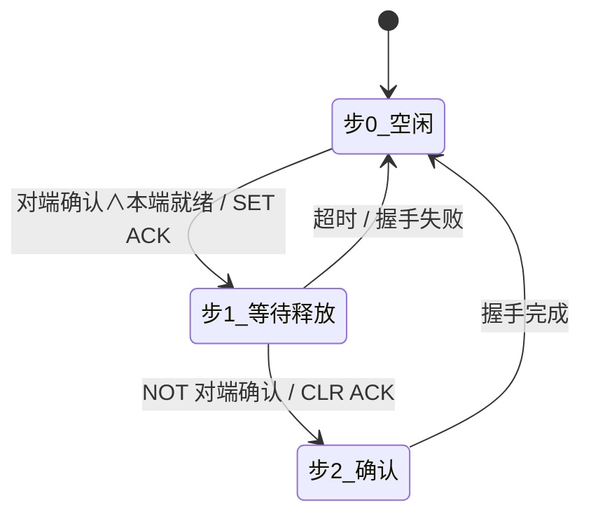

# 三向令牌握手 — 工位间安全传递协议

**版本**：V1.0  
**日期**：2026-06-06  
**适用 PLC**：信捷 XD/XE 系列  

---

## 一、为什么需要三向握手

传统互锁用两个 M 位：上游 SET 一个请求位，下游检测到后动作。流程走到位后清零。

**问题**：
- 上游发令牌后不知道下游是否收到
- PLC 扫描周期错开 1 拍 → 令牌丢失
- 急停/暂停后令牌残留，恢复运行可能误发板
- 卡住时无法判断死在哪一步

**三向握手**用 REQ→ACK→REQ释放→ACK释放 四个事件形成闭环：

```
上游 REQ  ___/‾‾‾‾‾‾‾‾‾‾‾‾‾‾\__________
下游 ACK  ________/‾‾‾‾‾‾‾‾‾‾‾\_________
           ↑     ↑        ↑        ↑
        有料   收到ACK  准备送板  握手闭环
```

---

## 二、FB 接口

一个 FB 同时支持上游/下游，通过 `角色` 引脚切换：

| 引脚 | 方向 | 上游 | 下游 |
|---|---|---|---|
| `角色` | IN | TRUE | FALSE |
| `本端就绪` | IN | 有料待送 | 空闲可接 |
| `对端确认` | IN | 接对方`请求信号` | 接对方`请求信号` |
| `超时时间` | IN | ms | ms |
| `急停复位` | IN | 强制清零 | 强制清零 |
| `请求信号` | OUT | REQ → 接对方`对端确认` | ACK → 接对方`对端确认` |
| `握手完成` | OUT | 单周期脉冲 | 单周期脉冲 |
| `握手失败` | OUT | 单周期脉冲 | 单周期脉冲 |
| `当前步` | OUT | 0/1/2 | 0/1/2 |
| `超时报警` | OUT | 持续 ON | 持续 ON |

---

## 三、接线规则

一条链路用两个实例，**请求信号 ↔ 对端确认 必须交叉**：

```
              上游FB                        下游FB
         ┌──────────────┐              ┌──────────────┐
         │ 角色 = TRUE   │              │ 角色 = FALSE  │
         │              │              │              │
   有料 → 本端就绪        │              │ 本端就绪 ← 空闲 │
         │              │              │              │
         │ 请求信号 ──────┼── REQ ──────→ 对端确认      │
         │              │              │              │
         │ 对端确认 ←─────┼── ACK ──────┤ 请求信号      │
         │              │              │              │
         │ 握手完成 → 送板 │              │ 握手完成 → 接板 │
         └──────────────┘              └──────────────┘
```

---

## 四、状态机流程

### 上游（主动方）



### 下游（被动方）



---

## 五、调用示例

```st
// 左前等待线体（上游）
左前_上游令牌(
    角色     := TRUE,
    本端就绪 := M30 AND (NOT M41),       // 有板 ∧ 下游不在中间
    对端确认 := 前平移_下游令牌.请求信号,  // 交叉！
    超时时间 := 3000,
    急停复位 := M221
);

// 前平移机（下游）
前平移_下游令牌(
    角色     := FALSE,
    本端就绪 := M1090,                   // 前门到位 = 可接板
    对端确认 := 左前_上游令牌.请求信号,    // 交叉！
    超时时间 := 3000,
    急停复位 := M221
);

// 上游处理结果
IF 左前_上游令牌.握手完成 THEN
    // 开始送板...
END_IF;
IF 左前_上游令牌.超时报警 THEN
    SET M_报警_送板超时;
END_IF;
```

---

## 六、对比

| 场景 | 传统二向 | 三向握手 |
|---|---|---|
| 正常传递 | ✅ | ✅ |
| 下游忙没看见令牌 | 上游不知道 | 超时报警，不发板 |
| 上游 PLC 死机 | 下游傻等 | 等不到 REQ 释放 → 超时 |
| 急停恢复 | 令牌残留 | 复位线清零所有状态 |
| 诊断 | 不知道卡哪步 | `当前步` 输出：0/1/2 一目了然 |
| 多工位扩展 | 每对手动写 | 每对实例化一个 FB |

---

## 七、文件

| 文件 | 内容 |
|---|---|
| `FB_三向令牌.st` | 功能块本体 |
| `MAIN_三向令牌示例.st` | 左前等待 ↔ 前平移机 完整接线 |
