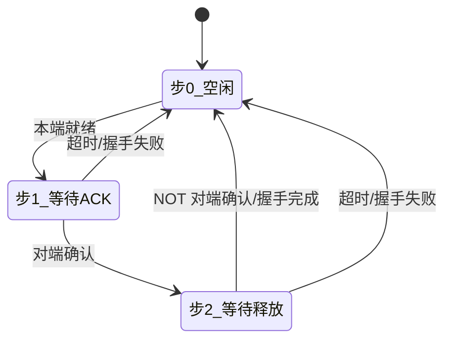
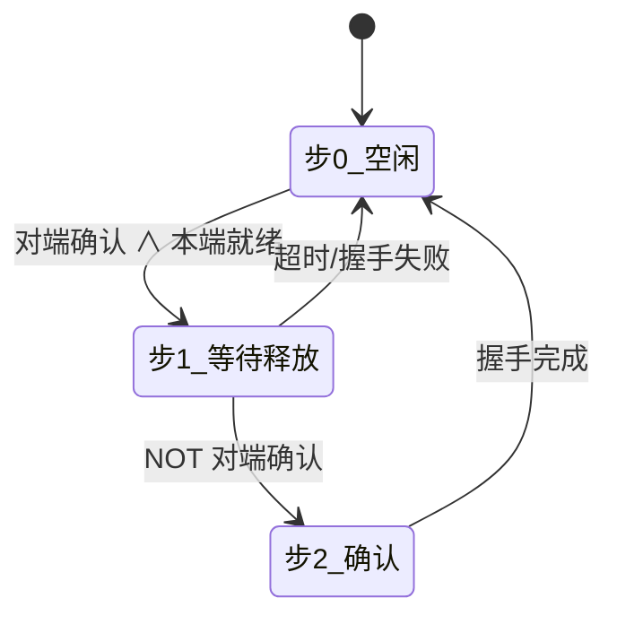

# 三向令牌握手 — 工位间安全传递协议

**版本**：V1.0  
**日期**：2026-06-06  
**适用 PLC**：信捷 XD/XE 系列  

---

## 一、背景

多工位自动化设备中，上下游传递工件时最常用的方式是"请求位 + 互锁"——上游 SET 一个 M 位，下游检测到后动作，流程走完清零。

这种方式在节拍不快时够用，但有两个致命短板：

- 上游不知道下游是否收到——PLC 扫描周期错开一拍，令牌就丢了
- 急停后令牌残留——恢复运行可能误发板

三向握手把"吼一嗓子"升级成"确认—回复—闭环"的可靠协议。

---

## 二、协议时序

```
上游 REQ  ___/‾‾‾‾‾‾‾‾‾‾‾‾‾‾\__________
下游 ACK  ________/‾‾‾‾‾‾‾‾‾‾‾\_________
           ↑     ↑        ↑        ↑
        有料   收到ACK  准备送板  握手闭环
        (步1)  (步2)    (步3)    (步4)
```

四步闭环，缺任何一步都会触发超时报警回退。

---

## 三、FB 接口

一个 FB，通过 `角色` 引脚决定行为。一条链路用两个实例。

| 引脚 | 方向 | 上游(角色=TRUE) | 下游(角色=FALSE) |
|---|---|---|---|
| `角色` | IN | TRUE | FALSE |
| `本端就绪` | IN | 有料待送 | 空闲可接 |
| `对端确认` | IN | 接对方 `请求信号` | 接对方 `请求信号` |
| `超时时间` | IN | ms | ms |
| `急停复位` | IN | 强制回步0 | 强制回步0 |
| `请求信号` | OUT | REQ → 接对方 `对端确认` | ACK → 接对方 `对端确认` |
| `握手完成` | OUT | 单周期脉冲 | 单周期脉冲 |
| `握手失败` | OUT | 单周期脉冲 | 单周期脉冲 |
| `当前步` | OUT | 0/1/2 | 0/1/2 |
| `超时报警` | OUT | 持续 ON | 持续 ON |
| `握手故障` | OUT | 急停打断时 ON | 急停打断时 ON |

---

## 四、接线

**规则只有一条：请求信号 ↔ 对端确认 必须交叉。**

```
              上游FB                        下游FB
         ┌──────────────┐              ┌──────────────┐
         │ 角色 = TRUE   │              │ 角色 = FALSE  │
   有料 → 本端就绪        │              │ 本端就绪 ← 空闲 │
         │ 请求信号 ──────┼── REQ ────→ │ 对端确认      │
         │ 对端确认 ←─────┼── ACK ──── │ 请求信号      │
         │ 握手完成 → 送板 │              │ 握手完成 → 接板 │
         └──────────────┘              └──────────────┘
```

---

## 五、状态机

### 上游



### 下游



---

## 六、调用示例

```st
// 上游
工位A_令牌(
    角色     := TRUE,
    本端就绪 := A_有料检测 AND (NOT B_空闲检测),
    对端确认 := 工位B_令牌.请求信号,   // 交叉！
    超时时间 := 3000,
    急停复位 := 系统急停
);

// 下游
工位B_令牌(
    角色     := FALSE,
    本端就绪 := B_空闲检测,
    对端确认 := 工位A_令牌.请求信号,   // 交叉！
    超时时间 := 3000,
    急停复位 := 系统急停
);

// 处理结果
IF 工位A_令牌.握手完成 THEN  (* 开始送板 *) END_IF;
IF 工位A_令牌.握手失败 THEN  (* 报警 *)     END_IF;
IF 工位B_令牌.握手完成 THEN  (* 开始接板 *) END_IF;
```

---

## 七、与传统互锁对比

| 场景 | 传统二向互锁 | 三向握手 |
|---|---|---|
| 正常传递 | ✅ | ✅ |
| 下游忙没看见令牌 | 上游不知道，可能丢板 | 超时报警，不发板 |
| 急停恢复 | 令牌残留，可能误触发 | 复位线清零一切 |
| 卡料诊断 | 不知道卡哪步 | `当前步` 输出 0/1/2 精确到步 |
| 多工位扩展 | 每对手写一套逻辑 | 每对实例化一个 FB |

---

## 八、文件清单

| 文件 | 内容 |
|---|---|
| `FB_三向令牌.st` | 功能块本体 |
| `MAIN_三向令牌示例.st` | 完整调用示例 |
| `三向令牌握手说明书.md` | 本文件 |
