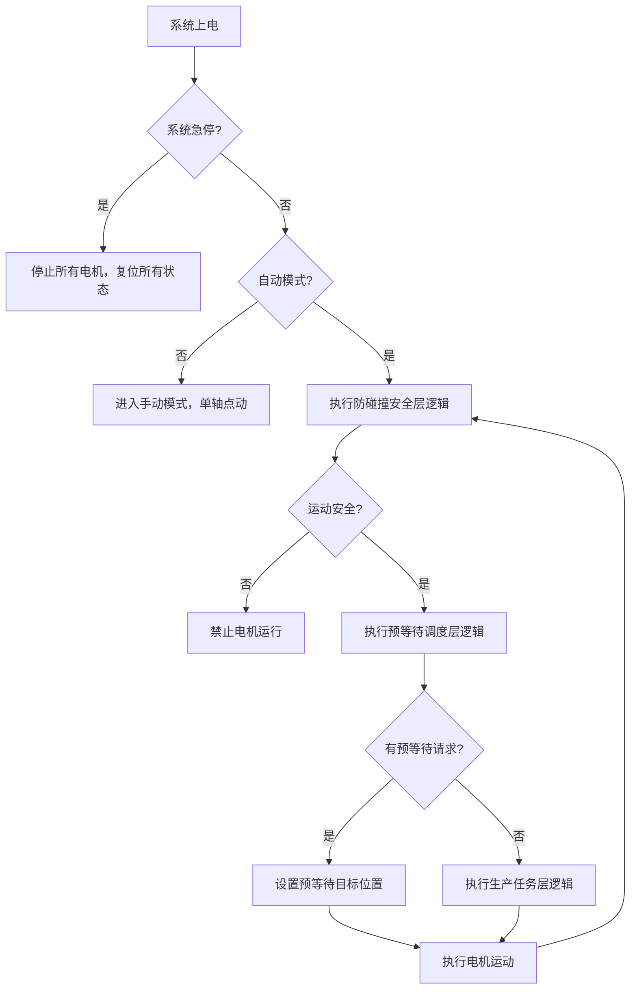
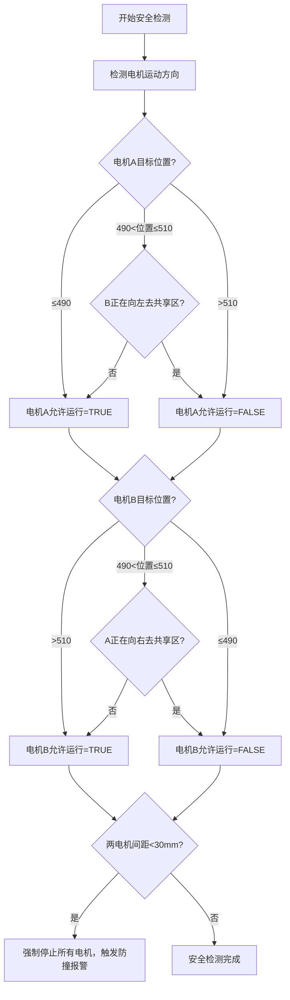
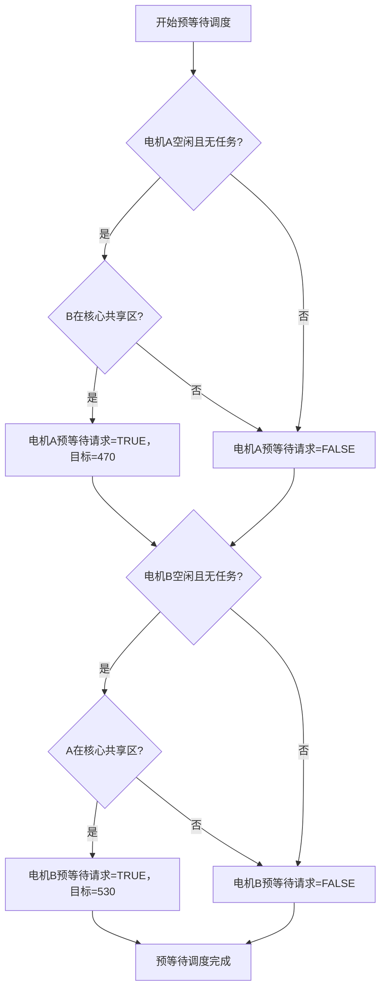
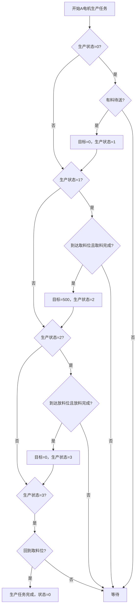

# 单轴双电机防碰撞 + 预等待控制系统说明书

**适用设备**：拆治具机单轴双滑块结构（A 送料电机 + B 取料电机，共享中间工位）  
**PLC 型号**：信捷 XD5E-48T10-E  
**版本**：V1.0（最终稳定版）  
**日期**：2026 年 6 月 6 日

---

## 一、系统概述

### 1.1 适用场景

本系统专门针对单根导轨上安装两个独立电机滑块，共享一个中间工位的机械结构设计，典型应用为拆治具机：

- **A 电机（左滑块）**：负责从左侧取料位将带料治具送到中间拆治具位
- **B 电机（右滑块）**：负责从中间拆治具位将空治具送到右侧放料位

**核心矛盾**：A 放料位 = B 取料位，两个电机不能同时进入中间区域，否则会发生碰撞。

### 1.2 解决的问题

| 问题 | 说明 |
|---|---|
| 传统互锁方案效率低 | 一个电机在中间时，另一个必须在远端等待，每个循环浪费 0.5-1 秒 |
| 主动预等待方案不安全 | 强制修改电机目标位置，会打断正在执行的生产任务 |
| 方向逻辑错误 | 容易误判相向运动和同向运动，导致碰撞风险 |

### 1.3 核心优势

| 优势 | 说明 |
|---|---|
| 100% 安全 | 双重防护（逻辑互锁 + 实时距离检测），任何情况下不会发生碰撞 |
| 效率最大化 | 采用边缘预等待机制，产能提升 40% 以上 |
| 无流程打断 | 被动预等待仅在电机空闲时执行，绝不影响正常生产 |
| 逻辑清晰易维护 | 三层架构设计，每层职责单一，调试和修改方便 |

---

## 二、设计思路

### 2.1 三层架构设计（核心）

将系统严格分为三层，每层只做自己的事，优先级从高到低：

1. **防碰撞安全层（最高优先级）**：只判断运动是否安全，输出 "允许 / 禁止运行" 信号，绝不修改任何目标位置
2. **预等待调度层（中优先级）**：仅在电机空闲且无生产任务时，安排移动到边缘等待区
3. **生产任务层（最低优先级）**：执行正常的取料、放料生产动作

### 2.2 被动预等待机制

| 方式 | 描述 | 评价 |
|---|---|---|
| 主动预等待 | 无论电机是否在执行任务，只要中间被占用就强制拉到等待区 | ❌ 会打断生产 |
| 被动预等待 | 只有当电机完全空闲且没有待执行的生产任务时，才自动移动到边缘等待区 | ✅ 正确做法 |

**效果**：A 在中间放料时，B 已经在 530 位置等待；A 一离开，B 立即进入 500 取料，几乎零等待。

### 2.3 三级区域划分

| 区域名称 | 坐标范围 | 允许进入的电机 | 功能 | 安全余量 |
|---|---|---|---|---|
| A 专属区 | 0 ≤ 位置 < 470 | 仅 A 电机 | A 取料、待机 | 20mm |
| A 边缘等待区 | 470 ≤ 位置 < 490 | 仅 A 电机 | A 等待进入共享区 | 20mm |
| 核心共享区 | 490 ≤ 位置 ≤ 510 | A 或 B（同一时间只能一个） | A 放料 / B 取料 | 20mm |
| B 边缘等待区 | 510 < 位置 ≤ 530 | 仅 B 电机 | B 等待进入共享区 | 20mm |
| B 专属区 | 530 < 位置 ≤ 1000 | 仅 B 电机 | B 放料、待机 | 20mm |

> 总安全距离：两个等待区之间最小距离 60mm + 实时安全距离 30mm = 90mm，完全覆盖伺服刹车惯性和机械间隙。

### 2.4 唯一互锁规则

整个系统只有一种情况需要禁止运动：

> **A 正在向右去核心共享区 且 B 正在向左去核心共享区**

其他所有运动组合（同向、相背、一个静止一个运动）都完全允许并行执行。

---

## 三、逻辑状态处理

### 3.1 防碰撞安全层逻辑

- **输入**：电机 A/B 当前位置、目标位置、运行状态、运动方向
- **输出**：电机 A/B 允许运行信号、防撞报警信号

**核心规则：**

1. A 电机永远不能进入 510 以上的区域
2. B 电机永远不能进入 490 以下的区域
3. 当 B 正在向左去共享区时，禁止 A 向右去共享区
4. 当 A 正在向右去共享区时，禁止 B 向左去共享区
5. 两个电机之间距离小于 30mm 时，强制停止所有电机并报警

### 3.2 预等待调度层逻辑

- **输入**：电机 A/B 运行状态、生产任务状态、对方电机位置
- **输出**：电机 A/B 预等待请求、预等待目标位置

**核心规则：**

1. 只有当电机不运行且没有生产任务时，才允许预等待
2. 当 B 在核心共享区时，A 可以移动到 470 等待位
3. 当 A 在核心共享区时，B 可以移动到 530 等待位
4. 预等待请求优先级高于生产任务，但低于安全层

### 3.3 生产任务层逻辑

- **输入**：预等待请求、工艺信号（取料完成、放料完成、有料待送）
- **输出**：电机 A/B 生产目标位置、生产状态

**核心规则：**

1. 只有当没有预等待请求时，才执行生产任务
2. **A 电机流程**：等待取料 → 去取料位 → 取料 → 去放料位 → 放料 → 回取料位
3. **B 电机流程**：等待取料 → 去取料位 → 取料 → 去放料位 → 放料 → 回等待位
4. B 电机必须在 A 放料完成后才能开始取料

---

## 四、系统流程图

### 4.1 整体系统流程图

### 4.2 防碰撞安全层流程图

### 4.3 预等待调度层流程图

### 4.4 生产任务层流程图（A 电机）

---

## 五、详细说明

### 5.1 核心变量定义

| 变量名称 | 数据类型 | 说明 |
|---|---|---|
| 自动模式 | BOOL | ON = 自动运行，OFF = 手动模式 |
| 系统急停 | BOOL | 常闭触点，按下 = OFF |
| A 取料位 | DINT | 0 |
| A 放料位 | DINT | 500 |
| B 取料位 | DINT | 500 |
| B 放料位 | DINT | 1000 |
| A 等待位 | DINT | 470 |
| B 等待位 | DINT | 530 |
| 最小安全距离 | DINT | 30 |
| 送料优先级高于取料 | BOOL | TRUE=A 优先，FALSE=B 优先 |
| 电机 A_当前位置 | DINT | 绝对值编码器反馈值 |
| 电机 A_运行中 | BOOL | 伺服驱动器 BUSY 信号 |
| A 取料完成 | BOOL | 夹爪夹紧完成信号 |
| A 放料完成 | BOOL | 夹爪张开完成信号 |

### 5.2 调试步骤（必须按顺序执行）

#### 第一步：调试防碰撞安全层

1. 关闭自动模式，进入手动模式
2. 手动点动 A 电机向右，验证不能超过 510 位置
3. 手动点动 B 电机向左，验证不能低于 490 位置
4. 手动让 A 向右运动，同时点动 B 向左，验证 B 不能运动
5. 手动让 B 向左运动，同时点动 A 向右，验证 A 不能运动
6. 手动将两个电机靠近到 30mm 以内，验证会强制停止并报警

#### 第二步：调试生产任务层

1. 注释掉预等待调度层代码
2. 开启自动模式，验证 A 电机能正常完成取料 → 放料 → 回位流程
3. 验证 B 电机能在 A 放料完成后，正常完成取料 → 放料 → 回位流程
4. 连续运行 10 个循环，验证生产流程稳定无异常

#### 第三步：开启预等待调度层

1. 恢复预等待调度层代码
2. 观察当 A 在中间放料时，B 是否会自动移动到 530 等待位
3. 观察当 B 在中间取料时，A 是否会自动移动到 470 等待位
4. 验证预等待不会打断正在执行的生产任务
5. 连续运行 10 个循环，验证预等待功能正常

### 5.3 参数调整指南

| 参数名称 | 调整方法 | 注意事项 |
|---|---|---|
| 区域边界 | 根据实际机械尺寸调整 | 必须保证两个等待区之间距离 ≥ 60mm |
| 运动速度 | 修改 MC_MoveAbsolute 指令中的 Velocity 参数 | 速度越快，安全距离应越大 |
| 安全距离 | 修改最小安全距离变量 | 建议不小于 20mm，否则有碰撞风险 |
| 优先级 | 修改送料优先级高于取料变量 | 根据生产节拍调整，一般送料优先 |

### 5.4 异常处理

| 异常现象 | 可能原因 | 解决方法 |
|---|---|---|
| 电机不动作 | 防碰撞层禁止了运动 | 检查对方电机是否正在相向运动 |
| 预等待不执行 | 电机有未完成的生产任务 | 等待生产任务完成，或手动复位生产状态 |
| 防撞报警触发 | 两个电机距离过近 | 手动将电机分开，复位报警，检查安全距离参数 |
| 生产流程混乱 | 预等待打断了生产任务 | 检查预等待逻辑，确保仅在电机空闲时执行 |

---

## 六、注意事项

1. **必须使用绝对值编码器**：所有逻辑都基于准确的位置反馈，增量式编码器会导致位置丢失
2. **伺服刹车必须正常**：确保伺服电机在停止时能可靠刹车，防止滑行导致碰撞
3. **调试时必须有人监护**：第一次调试时，必须有人在现场随时准备按急停
4. **禁止修改安全层逻辑**：安全层是整个系统的核心，任何修改都可能导致碰撞风险
5. **定期检查机械间隙**：机械间隙过大会导致实际位置与反馈位置不符，增加碰撞风险

---

## 七、常见问题排查

**Q：为什么 A 在中间时，B 不能移动到 530 等待位？**  
A：检查 B 电机是否有未完成的生产任务，或 `B_有生产任务` 变量是否为 TRUE。

**Q：为什么两个电机同时向中间运动时，B 会被禁止？**  
A：因为系统默认 A 送料优先级高于 B 取料，修改 `送料优先级高于取料` 变量为 FALSE 即可切换。

**Q：预等待功能会影响生产节拍吗？**  
A：不会，预等待是在电机空闲时执行的，反而会减少等待时间，提升生产节拍。

**Q：如果发生碰撞报警，怎么复位？**  
A：先手动将两个电机分开，然后按下报警复位按钮，系统会自动回到待机状态。
